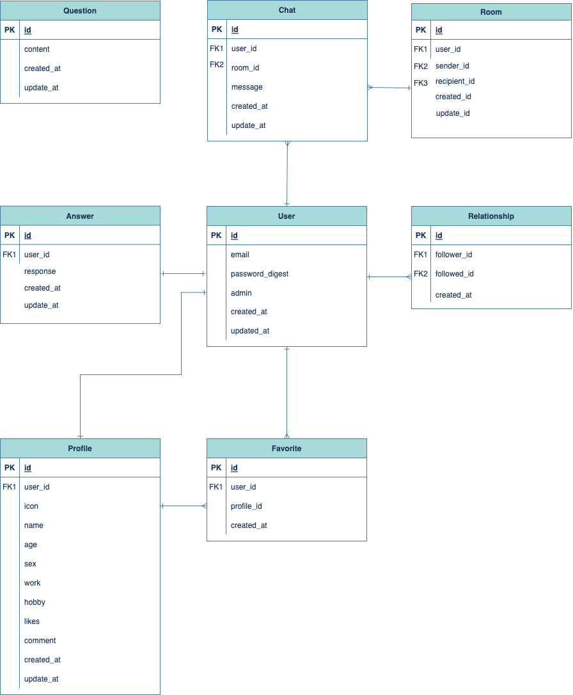
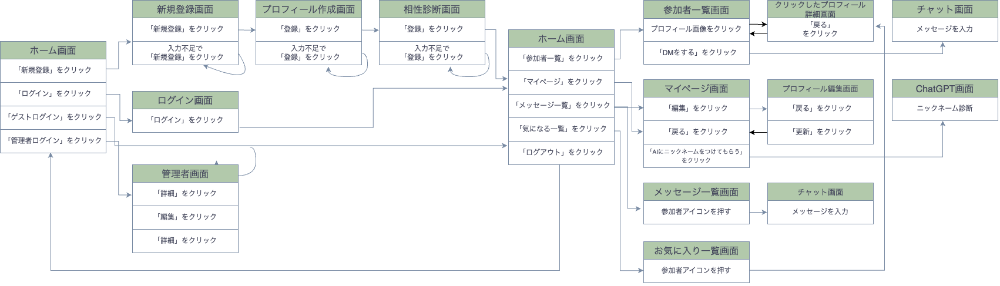

# README

## 開発言語
* ruby 3.0.1
* Rails 6.0.6.1
## 就職Termの技術
* gem devise
* 1対1のメッセージ機能
* フォロー機能
* お気に入り機能
* メッセージ機能
## カリキュラム外の技術
* ChatGPT API
* gem rails_admin
* gem cancancan
## 実行手順
```
$ git clone git@github.com:Uchiborii/CONKT.git
$ cd CONKT
$ bundle install
$ yarn install
$ rails db:create
$ rails db:migrate
$ rails s
```

## 実行手順（Docker）

Docker が実行できることを前提とする。

```bash
$ docker compose build --no-cache
$ docker-compose run web rails db:create
$ docker-compose run web rails db:migrate
$ docker-compose up -d     
```

## カタログ設計
https://docs.google.com/spreadsheets/d/1hzKy_m9XlAHrNo-fmcSKu1MItFOqVcAUTCDqECsPcnM/edit#gid=782464957
## テーブル定義書
https://docs.google.com/spreadsheets/d/1hzKy_m9XlAHrNo-fmcSKu1MItFOqVcAUTCDqECsPcnM/edit#gid=2020033787
## ワイヤーフレーム
https://www.figma.com/file/PJ0pX5xCeXPlS7QdCA9I0G/Untitled?type=design&node-id=1%3A2&mode=design&t=wKpaE8JnLBce6yFd-1
## ER図

## 画面遷移図

